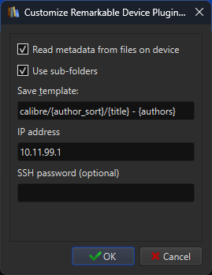

Sync your epub/pdf to Remarkable with Calibre
==========================================================
This Calibre plugin implements Calibre's [Device Plugin](https://manual.calibre-ebook.com/plugins.html#module-calibre.devices.interface), 
making the Remarkable  Tablet a device Calibre can communicate with, similar to other supported Ebook readers.

The plugin will create the necessary folder structure (by default under `calibre/{author_sort}/{title} - {authors}`, News are uploaded to a separate folder `News`)

Requirements
------------
This plugin relies on the USB web interface -- but optionally also can use SSH if a new folder needs to be created.

If you wish to benefit from the automatic folder structure, please setup SSH and ensure that you can successfully SSH to your Remarkable tablet (see [here](https://support.remarkable.com/s/article/Developer-mode) and [here](https://remarkable.guide/guide/access/ssh.html)).

Installation
------------
[Download](https://github.com/andriniaina/remarkable-calibre-usb-device/releases/latest) the zip file, and install it in Calibre via the Plugin interface (from he main screen: `Preferences-->Plugins-->Load plugin from file`).

Configuration
-------------
Go to `Preferences-->Plugins-->Show only user installed plugins`, select the plugin and then open `Customize plugin`

SSH password can be empty if you have setup passwordless SSH using a local certificate.

Usage
-----
At Calibre startup, the plugin will attempt to find your Remarkable device. If it succeeds you should see "Device" button at the top which shows your books on your Remarkable Tablet. 

To send a book to your Remarkable Tablet, right click on the book, select "send to device" and then "send to main memory". The book will transfer and you should now see your book in the Device tab. If you want to remove a book, go to the Device tab, right click on the book and select to remove it.

If you start Calibre and you don't see the Device tab, most likely Calibre was not able to find or connect to your Remarkable tablet. Try running Calibre in debug using `calibre-debug -g` and see the messages in the console regarding trying to connect to the device.

Development
-----------
Git clone this repository. First run `create-plugin-zip.sh` in order to install the local dependencies. After making
the desired changes, run `calibre-customize -b ./ && calibre-debug -g ` from the  root project directory to install the
latest version of this plugin and launch Calibre.

Ensure all plugin functionality still works and submit a patch.

This repo contains a submodule for remarkable-fs. Unfortunately the version of remarkable-fs in pypy and the current
source on the master branch are not in sync. I would ideally have liked to require remarkable-fs as a dependency and have
the user install the pip version. However, because the current pypy version is out of date and because have remarkable-fs
included in the zipped plugin makes installation simpler for users I've decided just to include it in this repo. It is
the responsibility of this repo to keep the remarkable-fs submodule up to date. I would like to eventually stop
including this submodule, and have a requirement of installing it with pip like other normal dependencies.

Architecture
------------
This plugin sends files and creates folders by using `remarkable-fs` under the hood. Files and folders are created via
Remarkable's custom format, which makes them viewable in the default Remarkable UI. This means you will not be able to
see them in the Linux filesystem directly.

To keep track of which books have been synced on the device, we create a `.calbire.json` metadata file which stores the
Calibre state on the device. We try and maintain this file in sync with the state in Calibre.

Bugs
----
Yes.

Thanks
------
[Calibre](https://github.com/kovidgoyal/calibre) for making a great ebook manager.

[remarkable-fs](https://github.com/nick8325/remarkable-fs) for implementing a great API for 
communication with the Remarkable tablet.

All developers in the Remarkable community.