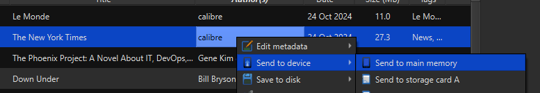

A Calibre [Device Plugin](https://manual.calibre-ebook.com/plugins.html#module-calibre.devices.interface) for Remarkable 2 / Remarkable Paper Pro.

The plugin supports folders and will create the necessary folder structure on the Remarkable (by default under `calibre/{author_sort}/{title} - {authors}`, News feeds are uploaded to a separate folder `News`)

Features:
* upload, using calibre folder structure
* delete files
* view files

Requirements
------------
This plugin relies on the USB web interface but optionally heavily relies on SSH for a lot of features (organizing books into folders, lookup for books on device, etc.)

If you wish to benefit of the full features, please setup SSH and ensure that you can successfully SSH to your Remarkable tablet **without a password** (see [here](https://remarkable.guide/guide/access/ssh.html)).

Installation
------------
[Download](https://github.com/andriniaina/remarkable-calibre-usb-device/releases/latest) the zip file, and install it in Calibre via the Plugin interface (from the main screen: `Preferences-->Plugins-->Load plugin from file`).

Configuration
-------------
Go to `Preferences-->Plugins-->Show only user installed plugins`, select the plugin and then `Customize plugin`

The password field is for future use and DOES NOT WORK yet and is only there for future use. You **need to setup an SSH certificate** (see [here](https://remarkable.guide/guide/access/ssh.html))

Usage
-----
At Calibre startup, the plugin will attempt to find your Remarkable device (by default on ip address 10.11.99.1). If it succeeds you should see "Device" button at the top which shows your books on your Remarkable Tablet.

To send a book to your Remarkable Tablet, right click on the book, select "send to device" and then "send to main memory". The book will transfer and you should now see your book in the Device tab.

If you start Calibre and you don't see the Device tab, most likely Calibre was not able to find or connect to your Remarkable tablet. Try running Calibre in debug using `calibre-debug -g` and see the messages in the console regarding trying to connect to the device.

Donate
------
I wrote this mainly for myself but if you find this useful, donate [here](https://github.com/sponsors/andriniaina) or on [patreon](https://patreon.com/andriniaina)

Troubleshooting
------
1. On my Remarkable, there seems to be [a bug](https://www.google.com/search?q=remarkable+usb+web+interface+not+working+site%3Areddit.com) where the web interface is sometimes not responding or not properly starting. Open the URL http://10.11.99.1 in a browser and make sure the web interface is showing.
2. make sure you can SSH to the device

Thanks
------

* [Calibre](https://github.com/kovidgoyal/calibre) for making a great ebook manager.
* [naclander](https://github.com/naclander/Calibre-Remarkable-Device-Driver-Plugin) for the original plugin.

All developers in the Remarkable community.
